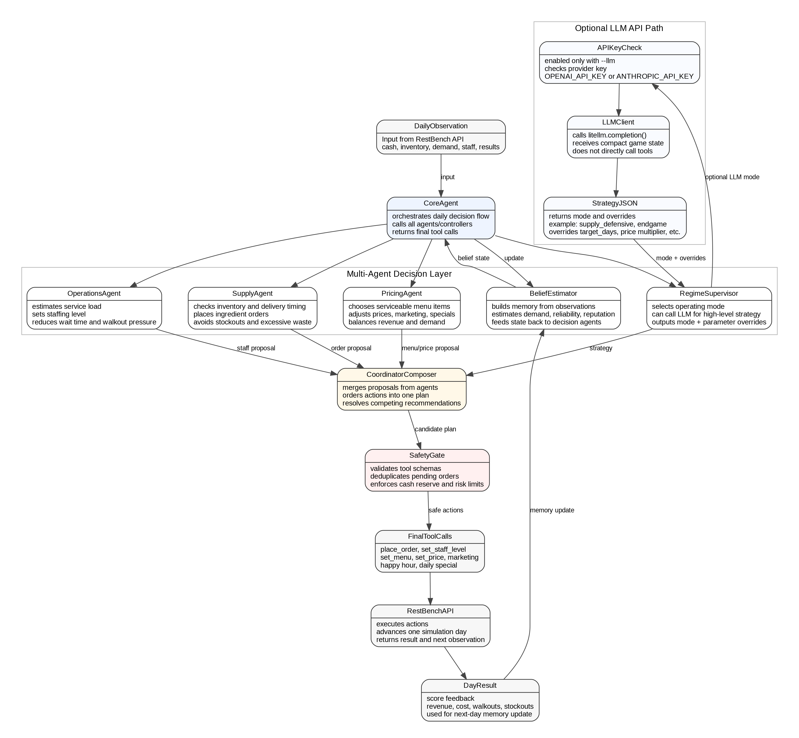

# RestBench Team Agent

An AI agent that runs a 30-day Italian restaurant simulation. It places orders, sets staff, prices dishes, and runs promos — all through a REST API. Score = profit − penalties; bankruptcy = −100,000.

This is an **Option A — LLM-based agent**. We use LLMs inside each specialist agent (and as a high-level strategy supervisor), wrapped in a multi-agent stack with an auto-research memory loop.

**Team name:** `liquid_italian`


**Page:** [link to project page](https://zoexor.github.io/20260518hackathon-page)
---

## 1. Introduction

Each day the agent gets an observation (cash, inventory, suppliers, weather, reviews, alerts) and submits actions (orders, staff, menu, prices, marketing, happy hour, daily special).

We picked **Option A (LLM-based agent)** because the game has hidden variables — real demand, price elasticity, supplier reliability, scoring weights, and hidden scenarios. Pure rules can't read alerts and reviews well; pure LLM-driven action emission is fragile. So we use LLMs **inside specialist agents** where their reasoning helps, and keep the API-touching layer narrow and structured.

Reference docs:

- [docs/product-architecture.md](docs/product-architecture.md) — product view + diagrams
- [docs/code-structure-and-llm.md](docs/code-structure-and-llm.md) — file map + LLM call paths
- [AGENT_CONTRACT.md](AGENT_CONTRACT.md) — full game spec
- [STRATEGY_GUIDE.md](STRATEGY_GUIDE.md) — gameplay heuristics

---

## 2. Architecture — LLM + Multi-Agent + Auto-Research



`CoreAgent` ([restbench/agent.py](restbench/agent.py)) orchestrates the daily cycle: read observation → run each specialist → produce final tool calls. The decision layer has five specialists, each focused on one job. Each one uses the LLM differently depending on what its job needs.

### `RegimeSupervisor` ([restbench/regime.py](restbench/regime.py))

**Job.** Pick today's high-level operating mode and a handful of parameter overrides.

**How LLM fits in.** This is where the LLM does most of its work. We hand it a short summary of today's situation (cash, inventory pressure, walkouts, alerts, days left) and ask one question: *what mode are we in today?* The LLM answers with a small JSON: a mode name plus a few numeric knobs. That's it — no tool calls, no free-form text. Modes: `normal | supply_defensive | demand_surge | demand_slump | endgame`.

### `SupplyAgent` ([restbench/controllers/supply.py](restbench/controllers/supply.py))

**Job.** Decide what to order, from whom, how much, when — avoiding stockouts and waste.

**How LLM fits in.** Calendar math (lead times, delivery days, shelf life) stays in code — LLMs get this wrong. Instead, the LLM tells SupplyAgent *how cautious to be*: how many days of stock to hold, and how much to distrust shaky suppliers. If an alert says "supplier X halted," the LLM turns up the caution dial, and SupplyAgent does the rest.

### `OperationsAgent` ([restbench/controllers/operations.py](restbench/controllers/operations.py))

**Job.** Set staffing to balance walkouts against labor cost.

**How LLM fits in.** Code forecasts tomorrow's covers from day-of-week, weather, and reputation, then converts that into a staff number. The LLM only sets the posture through `mode`: `demand_surge` says "staff up for safety", `demand_slump`/`endgame` says "cut headcount". LLM picks the posture, code picks the number.

### `PricingAgent` ([restbench/controllers/pricing.py](restbench/controllers/pricing.py))

**Job.** Pick the active menu, dish prices, marketing spend, happy hour, and daily special.

**How LLM fits in.** Menu rules (≥5 dishes, only dishes we can actually cook) are enforced by code, so the LLM can't accidentally publish a menu that stocks out. The LLM nudges two dials: a price multiplier (raise or lower across the board) and a marketing switch (spend or save). Pricing posture comes from the LLM; menu safety comes from code.

### `BeliefEstimator` ([restbench/belief.py](restbench/belief.py)) — the auto-research agent

**Job.** Build memory across days: per-ingredient usage rates, supplier reliability, capacity-reduction memory, reputation trend, demand signals.

**How auto-research fits in.** This agent is the heart of the **auto-research loop**. "Auto-research" doesn't mean reading papers — it means **the system researches the simulator itself**. The game hides demand functions, price elasticity, supplier reliability, and scoring weights, and the final eval includes hidden scenarios we've never seen. So every day BeliefEstimator runs the research cycle:

1. **Collect evidence** — yesterday's `DayResult` (covers, walkouts, stockouts, delivery outcomes, reviews)
2. **Update hypotheses** — refine usage estimates, supplier reliability scores, demand trend
3. **Feed back into strategy** — belief state becomes input for `RegimeSupervisor`'s next LLM call

The LLM in `RegimeSupervisor` is reading BeliefEstimator's output as its main signal. So the loop is: evidence → updated beliefs → LLM picks mode → controllers act → new evidence. That's the same loop a researcher runs on an unknown system, but at one-day cadence inside the simulator.

---

## 3. Code Structure

```
agents/                  # entry points + evaluation
  team_agent.py          # main agent: main() + strategy() + configure_strategy(use_llm=...)
  evaluate.py            # multi-scenario × multi-seed runner
  runner.py              # HTTP game-lifecycle driver
  llm_template.py        # "LLM emits tool calls" reference (NOT the team agent)
  starter_template.py    # rule-based starter
  naive_rule.py / do_nothing.py / compare.py   # baselines

restbench/               # decision core
  agent.py               # daily pipeline
  belief.py              # auto-research memory
  regime.py              # RegimeSupervisor + LLMRegime (LLM call)
  composer.py            # merge / dedupe / order proposals
  safety.py              # final deterministic guard
  params.py              # tunable parameters
  replay.py              # replay-file writer
  llm_silence.py         # suppress noisy LiteLLM logs
  controllers/
    supply.py
    operations.py
    pricing.py

dashboard/               # local replay UI
  index.html             # trend charts
  research-readme.html   # team explanation page
dashboard_server.py

docs/
  product-architecture.md
  code-structure-and-llm.md
  restbench_multi_agent_uml_vertical.png

replays/                 # JSONL replays
tests/
```

### Running it

```powershell
python -m agents.team_agent

# dashboard
python dashboard_server.py
# → http://127.0.0.1:8765
```

---

## 4. Debug Dashboard

Debugging an agent across 30 days × multiple scenarios × multiple seeds is painful in raw logs. So we built a local **Trend Dashboard** ([dashboard_server.py](dashboard_server.py) + [dashboard/index.html](dashboard/index.html)) that reads any `replays/run_*.jsonl` file and renders the run as charts and a per-day table. Auto-refreshes every 3 seconds, so you can watch a live game as it runs.


What it shows:

- **Header strip** — scenario / seed, final score with score breakdown (profit, walkouts, reputation, waste), last cash, reputation/walkout band, coverage risk (zero-inventory + expiring counts), ops snapshot (staff, menu size, pending kg, current mode)
- **Trend charts** — cash, covers vs revenue, wait/walkout pressure, inventory risk, cost stack, staff/menu/pending qty, alerts/stockouts/substitutions, weather/reviews/utilization
- **Per-day snapshot table** — one row per day with cash, covers, revenue, costs, staff, menu count, walkout band, pending kg, zero-inv count, expiring-soon count, **regime mode**, action breakdown, and any alerts/stockouts

```powershell
# dashboard
python dashboard_server.py
# → http://127.0.0.1:8765
```
